# Spark SQL Big Data

Tugas ini merupakan bagian dari mata kuliah Big Data dan berfokus pada topik DataFrame dan Dataset pada Apache Spark.

## Spark Web UI
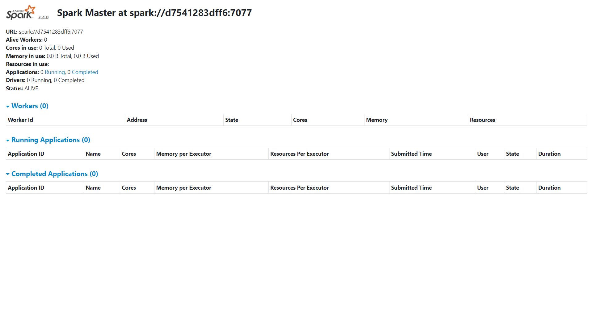

Spark Web UI adalah antarmuka pengguna web untuk memantau dan menganalisis aplikasi Spark. Spark Web UI menyediakan informasi detail tentang aplikasi Spark yang sedang berjalan, seperti status aplikasi, daftar tugas dan lain-lain.

## Metode 1: Membuat DataFrame dengan objek list, schema dan default data types
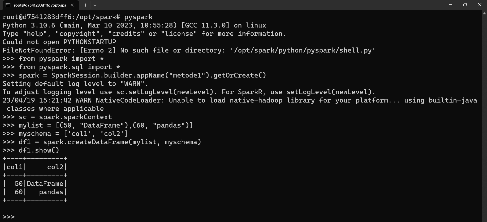

<pre>
<code>
from pyspark import *
from pyspark.sql import *
spark = SparkSession.builder.appName("metode1").getOrCreate()
sc = spark.sparkContext
mylist = [(50, "DataFrame"),(60, "pandas")]
myschema = ['col1', 'col2']
df1 = spark.createDataFrame(mylist, myschema)
df1.show()
</code>
</pre>

PySpark untuk membuat sebuah DataFrame pada Spark. Proses yang terjadi meliputi impor modul-modul PySpark, pembuatan objek SparkSession dengan nama aplikasi "metode1", pembuatan objek SparkContext untuk menghubungkan Spark dengan cluster, pembuatan list yang berisi tuple data, pembuatan list yang berisi nama kolom, pembuatan objek DataFrame dengan metode createDataFrame(), dan terakhir memanggil metode show() pada objek DataFrame untuk menampilkan isi dari DataFrame.

## Metode 2: Membuat DataFrame dengan parallelizing list dan konversi RDD ke DataFrame
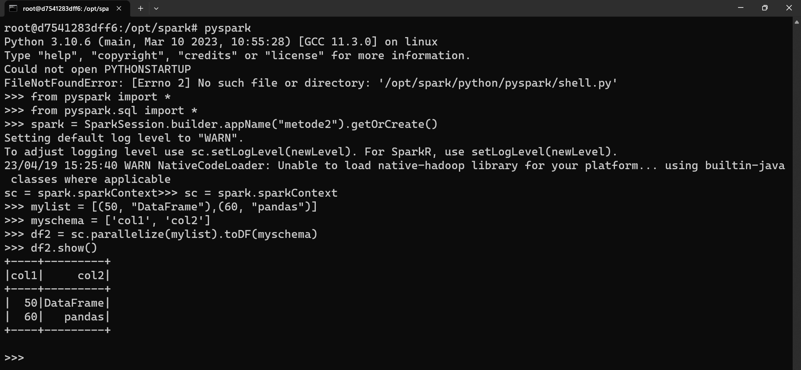

<pre>
<code>
from pyspark import *
from pyspark.sql import *
spark = SparkSession.builder.appName("metode2").getOrCreate()
sc = spark.sparkContext
mylist = [(50, "DataFrame"),(60, "pandas")]
myschema = ['col1', 'col2']
df2 = sc.parallelize(mylist).toDF(myschema)
df2.show()
</code>
</pre>

Proses pembuatan DataFrame menggunakan metode createDataFrame() dan parallelize(). Pertama-tama, dilakukan pembuatan objek SparkSession dengan nama aplikasi "metode2" menggunakan metode builder(). Kemudian, objek SparkContext dibuat untuk menghubungkan Spark dengan cluster. Selanjutnya, kita membuat sebuah list yang berisi tuple (50, "DataFrame") dan (60, "pandas"). Kemudian, sebuah list yang berisi nama kolom yaitu ['col1', 'col2'] dibuat. Objek DataFrame dibuat dengan menggunakan metode parallelize() pada objek SparkContext, yang akan mengambil list yang telah dibuat sebelumnya yaitu mylist dan myschema sebagai input. Terakhir, kita memanggil metode show() pada objek DataFrame df2 untuk menampilkan isi dari DataFrame.

## Method 3: Read data from a file, Infer schema and convert to DataFrame
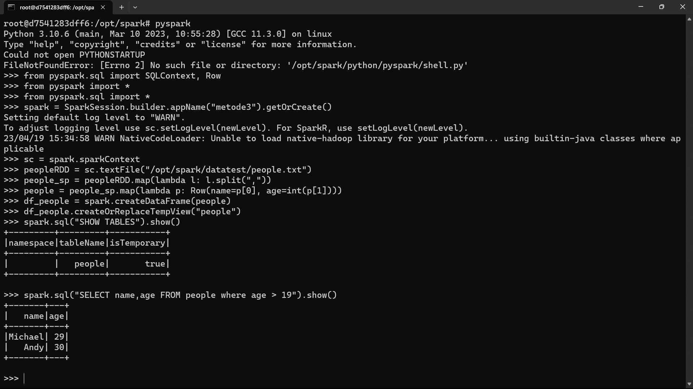

<pre>
<code>
from pyspark.sql import SQLContext, Row
from pyspark import *
from pyspark.sql import *
spark = SparkSession.builder.appName("metode3").getOrCreate()
sc = spark.sparkContext
peopleRDD = sc.textFile("/opt/spark/datatest/people.txt")
people_sp = peopleRDD.map(lambda l: l.split(","))
people = people_sp.map(lambda p: Row(name=p[0], age=int(p[1])))
df_people = spark.createDataFrame(people)
df_people.createOrReplaceTempView("people")
spark.sql("SHOW TABLES").show()
spark.sql("SELECT name,age FROM people where age > 19").show() 
</code>
</pre>

Dimulai dengan mengimpor modul-modul yang diperlukan dari PySpark, seperti SQLContext dan Row. Selanjutnya, objek SparkSession dibuat dengan nama aplikasi "metode3", dan objek SparkContext digunakan untuk menghubungkan Spark dengan cluster. Kemudian, file teks yang berisi data people dibaca menggunakan metode textFile() pada objek SparkContext, dan diubah menjadi RDD. Selanjutnya, RDD tersebut diubah menjadi RDD baru dengan menggunakan fungsi map() yang memisahkan setiap baris menjadi list yang berisi dua elemen, nama dan usia. Fungsi map() kedua kemudian digunakan untuk membuat objek Row yang berisi nama dan usia. Objek DataFrame kemudian dibuat dari RDD yang telah diubah tadi menggunakan metode createDataFrame() pada objek SparkSession, dan diikuti dengan pembuatan tabel sementara dengan nama "people" menggunakan metode createOrReplaceTempView(). Terakhir, dilakukan query terhadap tabel "people" untuk menampilkan kolom "name" dan "age" dimana usianya lebih besar dari 19 menggunakan metode spark.sql().

## Metode 4: Membaca data dari file, lalu assign schema secara programmatically

<pre>
<code>
from pyspark.sql import SQLContext, Row
from pyspark import *
from pyspark.sql import *
from pyspark.sql.types import StructField, StringType, IntegerType, StructType
spark = SparkSession.builder.appName("metode4").getOrCreate()
sc = spark.sparkContext
peopleRDD = sc.textFile("/opt/spark/datatest/people.txt")
people_sp = peopleRDD.map(lambda l: l.split(","))
people = people_sp.map(lambda p: Row(name=p[0], age=int(p[1])))
df_people = people_sp.map(lambda p: (p[0], p[1].strip()))
schemaStr = "name age"
fields = [StructField(field_name, StringType(), True) for field_name in schemaStr.split()]
schema = StructType(fields)
df_people = spark.createDataFrame(people,schema)
df_people.show()
df_people.createOrReplaceTempView("people")
spark.sql("select * from people").show() 
</code>
</pre>

SparkSession dengan nama aplikasi "metode4". Selanjutnya, objek SparkContext dibuat untuk menghubungkan Spark dengan cluster. File people.txt di-load menggunakan SparkContext dan diubah menjadi RDD. RDD ini kemudian diubah menjadi tuple menggunakan metode map() dengan lambda function. Tuple tersebut diubah menjadi Row dengan menggunakan lambda function. Data tersebut dibuat menjadi DataFrame dengan menggunakan metode createDataFrame() dengan menyediakan skema berupa objek StructType. DataFrame ditampilkan menggunakan metode show(). DataFrame kemudian disimpan menjadi view dengan nama "people" menggunakan metode createOrReplaceTempView(). Terakhir, query SQL pada view "people" dilakukan menggunakan metode spark.sql() dan hasilnya ditampilkan menggunakan metode show().

## Membuat DataFrame dari Database Eksternal 1
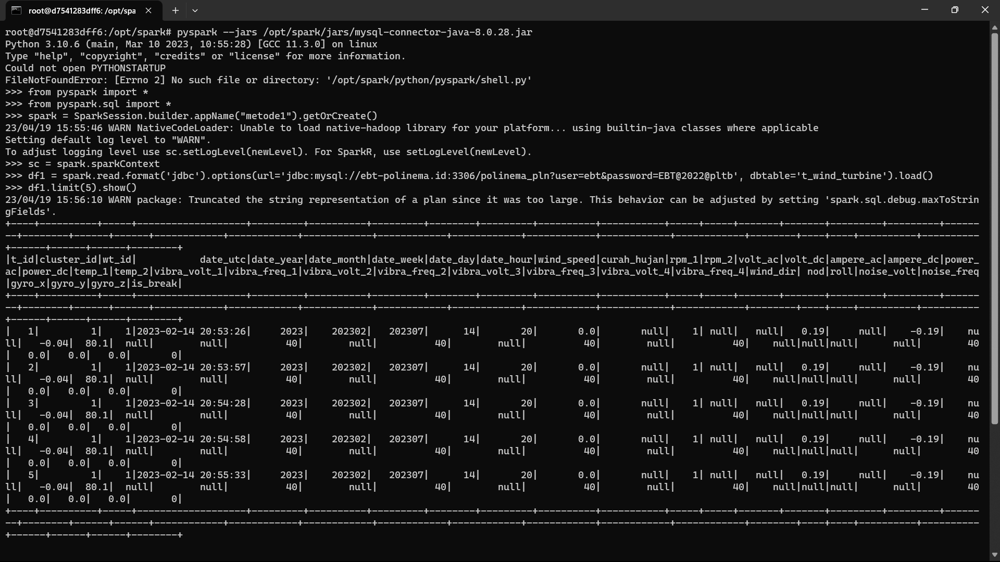

<pre>
<code>
from pyspark import *
from pyspark.sql import *
spark = SparkSession.builder.appName("metode1").getOrCreate()
sc = spark.sparkContext
df1 = spark.read.format('jdbc').options(url='jdbc:mysql://ebt-polinema.id:3306/polinema_pln?user=ebt&password=EBT@2022@pltb', dbtable='t_wind_turbine').load()
df1.limit(5).show()
</code>
</pre>

SparkSession dengan nama aplikasi "metode1" dibuat menggunakan metode builder(). Sesi Spark dengan nama aplikasi tersebut akan digunakan jika sudah ada, dan jika tidak maka sesi baru akan dibuat. Kemudian, objek SparkContext dibuat untuk menghubungkan Spark dengan cluster. Selanjutnya, DataFrame df1 dibuat dengan menggunakan metode read pada objek SparkSession dan format "jdbc" untuk membaca data dari database MySQL. Parameter lainnya seperti url dan dbtable diatur menggunakan options(). Data tersebut kemudian di-load dengan menggunakan metode load() dan disimpan dalam objek DataFrame df1. Terakhir, metode limit() digunakan untuk membatasi jumlah baris data yang ditampilkan pada objek DataFrame df1, kemudian hasilnya ditampilkan menggunakan metode show().

## Membuat DataFrame dari Database Eksternal 2
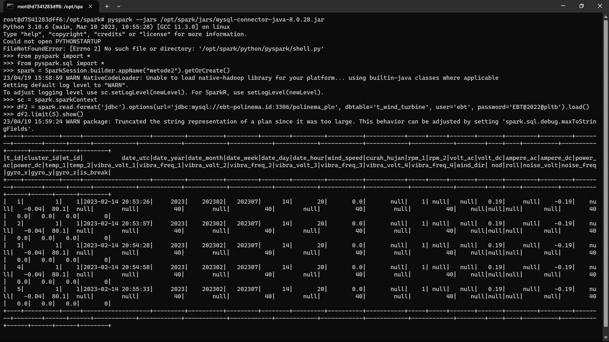

<pre>
<code>
from pyspark import *
from pyspark.sql import *
spark = SparkSession.builder.appName("metode2").getOrCreate()
sc = spark.sparkContext
df2 = spark.read.format('jdbc').options(url='jdbc:mysql://ebt-polinema.id:3306/polinema_pln', dbtable='t_wind_turbine', user='ebt', password='EBT@2022@pltb').load()
df2.limit(5).show()
</code>
</pre>

SparkSession dengan nama aplikasi "metode2" kemudian dibuat menggunakan metode builder(). Sesi Spark dengan nama aplikasi tersebut akan digunakan jika sudah ada, dan jika tidak maka sesi baru akan dibuat. Kemudian, objek SparkContext dibuat untuk menghubungkan Spark dengan cluster. File t_wind_turbine di-load menggunakan SparkContext dan diubah menjadi DataFrame menggunakan metode read() dengan format JDBC. Opsi untuk koneksi seperti URL, nama tabel, user, dan password disediakan dalam format options(). DataFrame kemudian ditampilkan menggunakan metode show() pada objek DataFrame df2.

## Mengonversi DataFrames ke RDDs

<pre>
<code>
from pyspark import *
from pyspark.sql import *
from pyspark.sql.types import StructField, StringType, IntegerType, StructType
spark = SparkSession.builder.appName("metode1").getOrCreate()
sc = spark.sparkContext
mylist = [(1, "Nama-NIM"),(3, "Big Data 2023")]
myschema = ['col1', 'col2']
df = spark.createDataFrame(mylist, myschema)
df.rdd.collect()
df2rdd = df.rdd
df2rdd.take(2)
</code>
</pre>

SparkSession dengan nama aplikasi "metode1" dibuat menggunakan metode builder(). Sesi Spark dengan nama aplikasi tersebut akan digunakan jika sudah ada, dan jika tidak maka sesi baru akan dibuat. Kemudian, sebuah list dengan dua tuple dan sebuah schema dibuat. List tersebut diubah menjadi DataFrame dengan menggunakan metode createDataFrame() pada objek SparkSession dengan mengambil data dari list dan menyediakan skema berupa objek StructType. DataFrame kemudian diubah menjadi RDD dengan menggunakan metode rdd pada objek DataFrame. Hasilnya kemudian ditampilkan menggunakan metode collect(). Objek RDD tersebut kemudian diambil dua baris teratas menggunakan metode take().

## Membuat Datasets 1
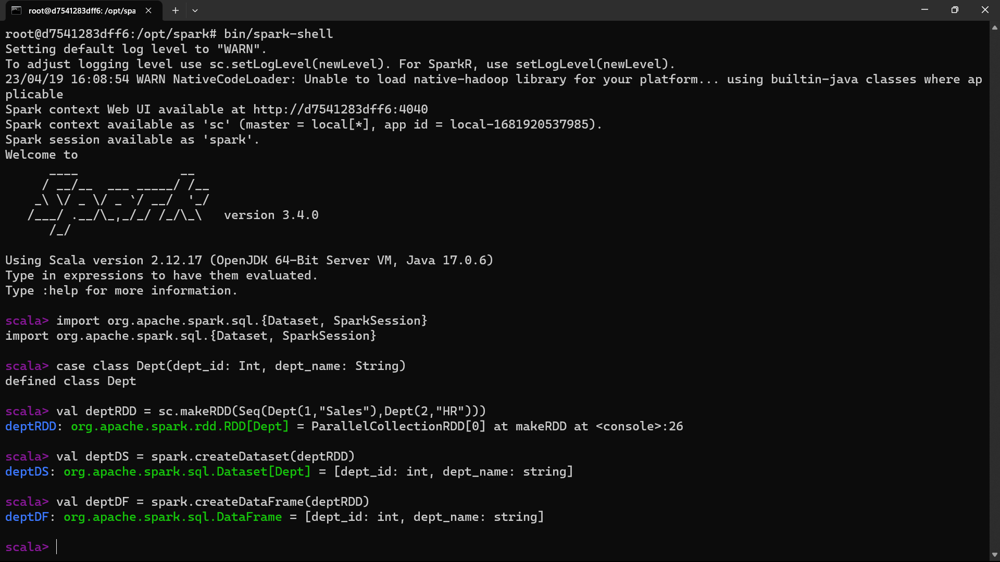

<pre>
<code>
import org.apache.spark.sql.{Dataset, SparkSession}
case class Dept(dept_id: Int, dept_name: String)
val deptRDD = sc.makeRDD(Seq(Dept(1,"Sales"),Dept(2,"HR")))
val deptDS = spark.createDataset(deptRDD)
val deptDF = spark.createDataFrame(deptRDD)
</code>
</pre>

implementasi Apache Spark dengan menggunakan bahasa Scala. Pertama-tama, impor modul yang dibutuhkan yaitu Dataset dan SparkSession. Kemudian, sebuah case class Dept dibuat yang memiliki dua atribut yaitu dept_id bertipe integer dan dept_name bertipe string. Selanjutnya, RDD (Resilient Distributed Dataset) deptRDD dibuat dengan menggunakan metode makeRDD() pada objek SparkContext dengan mem-passingkan sekumpulan data berupa instance dari case class Dept. Objek deptDS dan deptDF kemudian dibuat dengan menggunakan metode createDataset() dan createDataFrame() pada objek SparkSession yang mengambil RDD deptRDD sebagai input.

## Membuat Datasets 2 Error
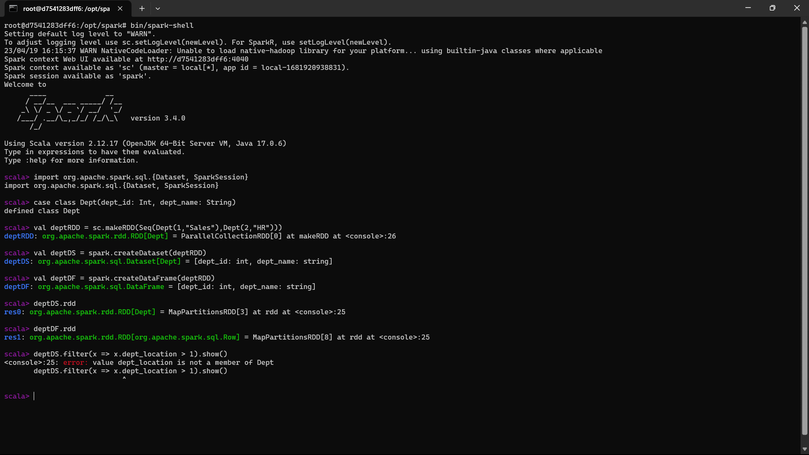

<pre>
<code>
import org.apache.spark.sql.{Dataset, SparkSession}
case class Dept(dept_id: Int, dept_name: String)
val deptRDD = sc.makeRDD(Seq(Dept(1,"Sales"),Dept(2,"HR")))
val deptDS = spark.createDataset(deptRDD)
val deptDF = spark.createDataFrame(deptRDD)
deptDS.rdd
deptDF.rdd
deptDS.filter(x => x.dept_location > 1).show()
</code>
</pre>

Case class Dept yang memiliki atribut dept_id dan dept_name. Selanjutnya, dibuat objek SparkSession dan SparkContext untuk menghubungkan Spark dengan cluster. Kemudian, dibuat sebuah RDD dan Dataset dari objek-objek Dept, serta sebuah DataFrame dari RDD tersebut. Namun, ketika method rdd digunakan untuk mengubah Dataset atau DataFrame menjadi RDD, terjadi error karena objek Dataset dan DataFrame tidak memiliki atribut dept_location yang diakses oleh filter().

## Membuat Datasets 2 Fix
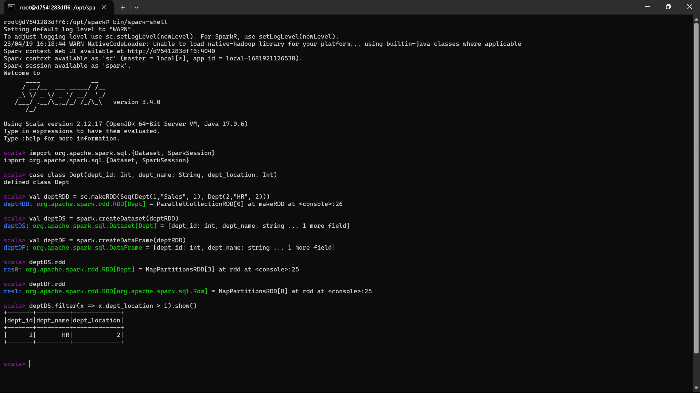

<pre>
<code>
import org.apache.spark.sql.{Dataset, SparkSession}
case class Dept(dept_id: Int, dept_name: String, dept_location: Int)
val deptRDD = sc.makeRDD(Seq(Dept(1,"Sales", 1), Dept(2,"HR", 2)))
val deptDS = spark.createDataset(deptRDD)
val deptDF = spark.createDataFrame(deptRDD)
deptDS.rdd
deptDF.rdd
deptDS.filter(x => x.dept_location > 1).show()
</code>
</pre>

Error terjadi karena dept_location tidak didefinisikan pada case class Dept. solusinya bisa dengan mengganti dept_location dengan dept_id atau menambahkan field dept_location pada case class-nya.

## Mengonversi DataFrame ke Datasets dan sebaliknya
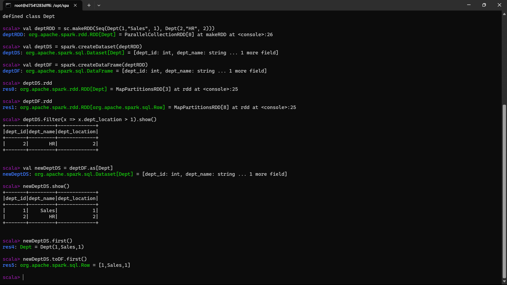

<pre>
<code>
import org.apache.spark.sql.{Dataset, SparkSession}
case class Dept(dept_id: Int, dept_name: String, dept_location: Int)
val deptRDD = sc.makeRDD(Seq(Dept(1,"Sales", 1), Dept(2,"HR", 2)))
val deptDS = spark.createDataset(deptRDD)
val deptDF = spark.createDataFrame(deptRDD)
deptDS.rdd
deptDF.rdd
deptDS.filter(x => x.dept_location > 1).show()
val newDeptDS = deptDF.as[Dept]
newDeptDS.show()
newDeptDS.first()
newDeptDS.toDF.first()
</code>
</pre>

Scala pada Spark untuk mengolah data menggunakan Dataset dan DataFrame. Pertama-tama, didefinisikan sebuah case class Dept untuk merepresentasikan data departemen. Kemudian, dibuat RDD dari data departemen menggunakan metode makeRDD() pada SparkContext, dan Dataset dan DataFrame dari RDD tersebut menggunakan createDataset() dan createDataFrame() pada SparkSession. Berikutnya, dilakukan transformasi data pada Dataset dengan melakukan filter dan menampilkan hasilnya menggunakan metode show(). Kemudian, dilakukan konversi dari DataFrame ke Dataset menggunakan as[] dan menampilkan hasilnya. Terakhir, dilakukan konversi dari Dataset kembali ke DataFrame menggunakan toDF() dan menampilkan hasilnya.

## Mengakses Metadata menggunakan Catalog
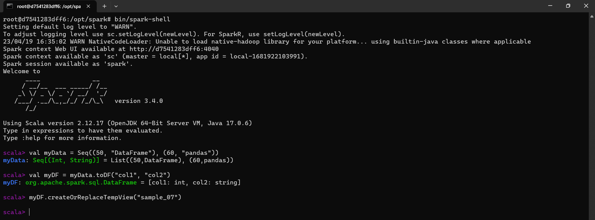
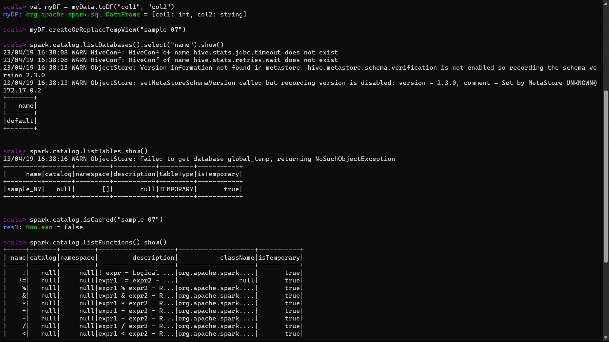

<pre>
<code>
# Membuat tabel sample_07
val myData = Seq((50, "DataFrame"), (60, "pandas"))
val myDF = myData.toDF("col1", "col2")
myDF.createOrReplaceTempView("sample_07")
</code>
<code>
spark.catalog.listDatabases().select("name").show()
spark.catalog.listTables.show()
spark.catalog.isCached("sample_07")
spark.catalog.listFunctions().show()
</code>
</pre>

Proses pengolahan data menggunakan API Spark pada bahasa pemrograman Scala. Pertama, dilakukan pembuatan sebuah tabel sederhana dengan nama "sample_07" dengan menggunakan data yang diambil dari Seq. Selanjutnya, dilakukan beberapa operasi terkait metadata dari katalog Spark, seperti menampilkan list database yang ada, menampilkan list tabel yang ada, mengecek apakah tabel "sample_07" sudah dicache atau belum, dan menampilkan list fungsi Spark yang tersedia. Semua operasi tersebut dapat dilakukan dengan menggunakan fungsi-fungsi pada katalog Spark.

## Mengonversi DataFrame ke Datasets dan sebaliknya

<pre>
<code>
from pyspark import *
from pyspark.sql import *
spark = SparkSession.builder.appName("metode1").getOrCreate()
sc = spark.sparkContext
df_txt = spark.read.text("/opt/spark/datatest/people.txt")
df_txt.show()
df_txt
</code>
</pre>

Membaca file teks "people.txt" dengan menggunakan PySpark. Terlebih dahulu, SparkSession dibuat menggunakan nama aplikasi "metode1". Kemudian, file teks dibaca menggunakan fungsi read.text() dari SparkSession dengan path file yang diinginkan. Setelah itu, hasil pembacaan file ditampilkan menggunakan show() dan juga disimpan dalam variabel df_txt.

